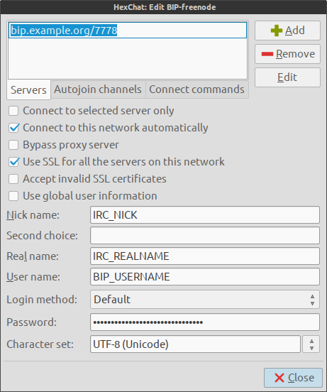

**I switched from BIP to [ZNC](http://wiki.znc.in/ZNC), and [recommend you use ZNC instead](/posts/znc-irc-proxy/)!**

[BIP](http://bip.milkypond.org/) is an IRC proxy that maintains a persistent
connection(s) to a list of IRC channels. You can then point your IRC client to
BIP each time you log in and playback the conversations that took place while
you were away.

I've found bBIP to be so useful that I now [maintain BIP for Arch Linux](https://www.archlinux.org/packages/community/x86_64/bip/),
although I now run my BIP proxy on Debian because my new VPS provider doesn't
offer Arch Linux as an option.

## Installing BIP

Installing BIP is simple for both Arch Linux and Debian.

### Debian

I run BIP on Debian Wheezy with the backport repository enabled.

```bash
sudo apt-get -t wheezy-backports install bip
sudo sed -i 's/ENABLED=0/ENABLED=1/' /etc/default/bip
```

### Arch Linux

```bash
pacman -S bip
systemctl enable bip
```

## Create a user

The next thing to do is create a username and password and BIP provides it's
own utility for doing this called `bipmkpw`. Replace 'username' with whatever
you want your BIP 'username' to be. This name has no relation to any IRC
usernames so it can be anything.

```bash
bipmkpw username
```

Enter a password when prompted. The password will then be output as a hash.
Make a note of both the hashed and un-hashed values somewhere, you will need
them later.

## Create a certificate

We don't want the username and password being sent as clear-text, so we will
create an SSL certificate for BIP to use.

```bash
openssl req -new -newkey rsa:4096 -nodes -x509 -keyout bip.pem -out bip.pem
```

Move the certificate to `/var/lib/bip`

```bash
sudo mv bip.pem /var/lib/bip
```

Change ownership and permissions of the certificate to the user `bip` which was
created automatically when the package was installed.

```bash
sudo chown bip:bip /var/lib/bip/bip.pem
sudo chmod 600 /var/lib/bip/bip.pem
```

## Configure BIP

Here is example configuration for BIP. Copy it to `/etc/bip.conf`, modify it
accordingly and then change the ownership and permissions.

```bash
sudo chown bip:bip /etc/bip.conf
sudo chmod 640 /etc/bip.conf
```

### Example configuration

```text
# bip default config file.
# Thou shoult change thy password

ip = "0.0.0.0";

# To connect a client to bip, try the port below, and
# be sure to set the password to the value
# specified in the network you want to connect to.
port = 7778;

# If you set this to true, you'll only be able to connect to bip
# with a SSL capable IRC client. Be sure to generate a certificate
# for bip with 'make cert'
client_side_ssl = true;

log_level = 3;

pid_file="/var/run/bip/bip.pid";

# This is where logs go. Channel and private messages will use that
# configuration value as a prefix, and then log_format to determine
# full log filename.
log_root = "/var/log/bip/";

# Log format allows you to make log filenames depend on the log line's
# attributes. Here's a list :
# %u -> user name
# %n -> network name
# %Y -> 4 digit year
# %m -> 2 digit month
# %d -> 2 digit day
# %c -> destination (#chan, privates, ...)
#log_format = "%n/%Y-%m/%c.%d.log";

# Sets the frequency (in seconds) of log syncing (real write to kernel)
#log_sync_interval = 5;

# Makes bip send the log of each channel and privates while
# you were not connected to the proxy upon connection.
backlog = true;         # enable backlog
backlog_lines = 0;      # number of lines in backlog, 0 means no limit
backlog_always = false; # backlog even lines already backlogged

# If blreset_on_talk talking on an irc network has the same effect of issuing
# /bip blreset, meaning that stuffed logged before the command won't be read
# back on backlog
blreset_on_talk = true;

# Network definition, a name and server info
network {
    name = "freenode";
    server { host = "chat.freenode.net"; port = 6667; };
};

network {
    name = "blitzed";
    server { host = "irc.blitzed.org"; port = 6667; };
};

# Configuration example with one user who connects to two irc networks
# To use the multi-server feature:
#  - define the connections
#  - chose and setup a different login for each connection
# on your irc client:
#  - Use the multi server feature of your client, the server being each time
#    the server where bip is running. In your client setup server password to:
#      username:password:connectionname
#  - do not store the password in clear here, use the bipmkpw util to generate
# a hash

# User structure is grouping information for a given user
user {
    # The name in bip of the user
    # This is used by bip only
    name = "USERNAME;   #BIP User account created with bipmkpw
    password = "00000000000000000000000000000000000000";  # the hash bipmkpw created
    ssl_check_mode = "none";

    # These will be the default for each connections
    default_nick = "NICKNAME";        #IRC Nick
    default_user = "IRCUSERNAME";     #IRC User
    default_realname = "REALNAME";    #IRC Real Name

    admin = true;
    backlog_msg_only = true;    # When true,

    # A user can have mutiple connections to irc networks.
    # define a connection:

    connection {
        name = "freenode";      # used by bip only
        network = "freenode";   # which ircnet to connect to

        # these will be sent to the real IRC server
        user = "IRCUSERNAME";
        realname = "IRCREALNAME";
        password = "serverpassword";  #can be commented out if not needed

        # Some options:
        follow_nick = true;
        ignore_first_nick = false;
        #on_connect_send = "PRIVMSG NickServ :IDENTIFY nspassword";

        # Autojoined channels:
        channel { name = "#cat"; };                   # Join #cat
        channel { name = "#dog"; backlog = false; };  # Join #dog but don't backlog it.
        channel { name = "#pig"; key = "01nk01nk"; }; # Join #pig that has a password.
    };

    connection {
        name = "blitzed";       # used by bip only
        network = "blitzed";    # which ircnet to connect to

        # these will be sent to the real IRC server
        user = "IRCUSERNAME";
        realname = "IRCREALNAME";
        password = "serverpassword";  #can be commented out if not needed

        # Some options:
        follow_nick = true;
        ignore_first_nick = false;
        #on_connect_send = "PRIVMSG NickServ :IDENTIFY nspassword";

        # Autojoined channels:
        channel { name = "#bar"; };
        channel { name = "#foo"; };
    };
};
```

If you require any clarification about what the configuration options do then
`man bip.conf` is your friend.

## Start BIP

Now that BIP is configured, it can be started.

### Debian

```bash
sudo /etc/init.d/bip start
```

### Arch Linux

```bash
sudo systemctl start bip
```

## Client configuration

I use [HexChat](http://hexchat.github.io/), but other IRC clients are available.
I add a new Network to HexChat for each of the IRC networks I defined in
`/etc/bip.conf`. The screen shot below shows how I configure a BIP network in
HexChat.



### Password format

The Password is the most important and confusing item. **This is for BIP,
not for any IRC network**. Remember the unhashed password? That goes here but
with a twist. The format for the password is:

```text
bipusername:unhashedbippassword:bipnetwork
```

Bipnetwork? What is that? It is from the following section of `/etc/bip.conf`
on the server?

```text
network {
    name = "freenode";
    server { host = "chat.freenode.net"; port = 6667; };
};
```

A more practical example:

```text
myuser:S3cr3tP@$$w0rd:freenode
```

## Conclusion

And that's it! We are now perpetually connected to IRC, can connect to BIP
proxy from multiple devices in a completely transparent and seamless manner.
Moreover, the logs for all channels are saved and automatically rotated on the
server.

If you looking for an alternative to BIP, then try [ZNC](http://wiki.znc.in/ZNC).

**References**

  * <https://wiki.linaro.org/Resources/HowTo/BIP>
  * <http://nerderati.com/2010/11/perpetual-irc-the-proxy-edition/>
  * <http://stevengorrell.com/bip-irc-proxy/>
