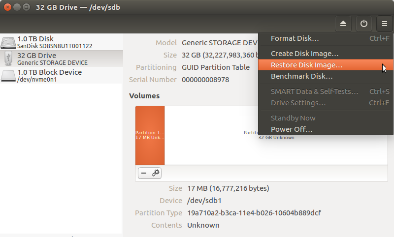

I recently bought the [Nextcloud Box](https://nextcloud.com/box/). When
it came to setting it up I ran into a problem, I only had Raspberry Pi 3
computers available and at the time of writing the microSDHC card
provided with the Nextcloud Box only supports the Raspberry Pi 2. *Bummer!*

# Overview

This guide outlines how to use [Ubuntu Core](https://www.ubuntu.com/core)
on the [Raspberry Pi 3](https://www.raspberrypi.org/) to run [Nextcloud](https://nextcloud.com/)
provided as a [snap](http://snapcraft.io) from the Ubuntu store.

If you're not familiar with Ubuntu Core, here's a quote:

> Ubuntu Core is a tiny, transactional version of Ubuntu for IoT devices and large container deployments. It runs a new breed of super-secure, remotely upgradeable Linux app packages known as snaps
>

After following this guide Ubuntu Core and any installed snaps (and
their data) will reside on the SD card and the 1TB hard disk in the
Nextcloud box will be available for file storage. This
guide explains how to:

  * Install and configure Ubuntu Core 16 for the Raspberry Pi 3
  * Format the 1TB hard disk in the Nextcloud Box and auto-mount it
  * Install the Nextcloud snap and connect the `removable-media` interface to allow access to the hard disk
  * Activate and configure the Nextcloud *External Storage* app so the hard disk can be used to store files
  * Optional configuration of Email and HTTPS for Nextcloud

## Prepare a microSDHC card

I explained the main steps in this post but you *really should* read and
follow the [Get started with a Raspberry Pi 2 or 3](https://developer.ubuntu.com/en/snappy/start/raspberry-pi-2/)
page as it fully explains how to use a desktop computer to download an
Ubuntu Core image for your Raspberry Pi 2 or 3 and copy it to an SD card
ready to boot.

Here's how to create an Ubuntu Core microSDHC card for the Raspberry Pi
3 using an Ubuntu desktop:

  * Download [Ubuntu Core 16 image for Raspberry Pi 3](http://releases.ubuntu.com/ubuntu-core/16/ubuntu-core-16-pi3.img.xz)
  * Insert the microSDHC card into your PC
    * Use [GNOME Disks](apt://gnome-disk-utility) and its *Restore Disk Image...* option, which **natively supports XZ compressed images.**
    * Select your SD card from the panel on the left
    * Click the "burger menu" on the right and Select *Restore Disk Image...*
    * Making sure the SD card is still selected, click the Power icon on the right.
  * Eject the SD card physically from your PC.

<div class="text-center"></div>

## Ubuntu Core first boot

An Ubuntu SSO account is required to setup the first user on Ubuntu Core:

  * Start by creating an [Ubuntu SSO account](https://login.ubuntu.com/)
  * Import an [SSH Key into your Ubuntu SSO account](https://login.ubuntu.com/ssh-keys)
    * Here are [instructions to generate an SSH Key](https://help.ubuntu.com/community/SSH/OpenSSH/Keys)
  * You'll need a keyboard and monitor connected to the Raspberry Pi 3 to go complete the first boot process and device configuration.

Insert the Ubuntu Core microSHDC into the Raspberry Pi, which should be
in the [assembled Nextcloud Box](https://nextcloud.com/wp-content/themes/next/assets/files/Box-Assembly-Guide.pdf?x16328)
with a keyboard and monitor connected. Plug in the power.

  * The system will boot then become ready to configure
  * The device will display the prompt *"Press enter to configure"*
  * Press enter then select *"Start"* to begin configuring your network and an administrator account. Follow the instructions on the screen, you will be asked to configure your network and enter your Ubuntu SSO credentials
  * At the end of the process, you will see your credentials to access your Ubuntu Core machine:

```text
This device is registered to <Ubuntu SSO email address>.
Remote access was enabled via authentication with the SSO user <Ubuntu SSO user name>
Public SSH keys were added to the device for remote access.
```

### Login

Once setup is done, you can login to Ubuntu Core using ssh, from a
computer on the same network, using the following command:

```bash
ssh <Ubuntu SSO user name>@<device IP address>
```

The user name is your Ubuntu SSO user name.

### Reconfiguring network

Should you need to reconfigure the network at a later stage you can do
so with:

```bash
sudo console-conf
```

## Prepare 1TB hard disk

Log in to your Raspberry Pi 3 running Ubuntu Core via ssh.

```bash
ssh <Ubuntu SSO user name>@<device IP address>
```

### Partition and format the Nextcloud Box hard disk

This will create a single partition formatted with the ext4 filesystem.

```bash
sudo fdisk /dev/sda
```

Do the following to create the partition:

```text
Command (m for help): o
Created a new DOS disklabel with disk identifier 0x253fea38.

Command (m for help): n
Partition type
    p   primary (0 primary, 0 extended, 4 free)
    e   extended (container for logical partitions)
Select (default p): p
Partition number (1-4, default 1): 1
First sector (2048-1953458175, default 2048):
Last sector, +sectors or +size{K,M,G,T,P} (2048-1953458175, default 1953458175):

Created a new partition 1 of type 'Linux' and of size 931.5 GiB.

Command (m for help): w
```

Now format the partition and give it the label **data**. This label will
be used to reference it for mounting later:

```bash
sudo mkfs.ext4 -L data /dev/sda1
```

### Automatically mount the partition

Most of the Ubuntu Core root file system is read-only, so it is not
possible to edit `/etc/fstab`. Therefore we'll use [systemd](https://www.freedesktop.org/wiki/Software/systemd/)
to achieve that.

Be aware of one of the `systemd.mount` pitfalls:

> Mount units must be named after the mount point directories they control. Example: the mount point /home/lennart must be configured in a unit file home-lennart.mount.

Yes that's right! **The unit filename must match the mount point path**.

Create the `media-data.mount` unit:

```bash
sudo vi /writable/system-data/etc/systemd/system/media-data.mount
```

Add the following content:

```systemd
[Unit]
Description=Mount unit for data

[Mount]
What=/dev/disk/by-label/data
Where=/media/data
Type=ext4

[Install]
WantedBy=multi-user.target
```

Reload systemd, scanning for new or changed units:

```bash
sudo systemctl daemon-reload
```

Start the `media-data.mount` unit, which will mount the volume, and also
enable it so it will be automatically mounted on boot.

```bash
sudo systemctl start media-data.mount
sudo systemctl enable media-data.mount
```

And just like any other unit, you can view its status using
`systemctl status`:

```bash
sudo systemctl status media-data.mount
```

## Update Ubuntu Core

Make sure Ubuntu Core is up-to-date and reboot.

```bash
sudo snap refresh
sudo reboot
```

After the reboot, make sure `/media/data` is mounted. If not double
check the steps above.

## Install Nextcloud

The Nextcloud snap uses the `removable-media` interface, which grants
access to `/media/*`, and requires manual connection:

```bash
sudo snap install nextcloud
sudo snap connect nextcloud:removable-media core:removable-media
```

Browse to the Nextcloud IP address and create the admin user account,
for example:

  * http://nextcloud.local/

## Nextcloud configuration

In the examples below replace `nextcloud.local` with the IP address or
hostname of your Nextcloud Box and replace `example.org` with your domain.

### External Storage

Enable the External Storge app via:

  * http://nextcloud.local/index.php/settings/apps?category=disabled#

Configure External Storage app via:

  * http://nextcloud.local/index.php/settings/admin/externalstorages

Use these settings:

  * Folder name: *data*
  * External storage: *Local*
  * Authentication: *None*
  * Configuration: `/media/data`
  * Available for: *All*

### Email

Configure your outgoing email settings via:

  * http://nextcloud.local/index.php/settings/admin/additional

I use [Sendgrid](https://sendgrid.com/) for sending email alerts from my
servers and devices. These are the settings that work for me:

  * Send mode: *SMTP*
  * Encryption: *STARTTLS*
  * From address: *nextcloud@example.org*
  * Authentication method: *Plain*
  * Authentication required: *Yes*
  * Server address: *smtp.sendgrid.net:587*
  * Username: `apikey`
  * Password: `theactualapikey`

### Enabling HTTPS

It is strongly recommend that you use HTTPS if you intend to expose your
Nextcloud to the Internet.

First do a test to see if you can install a Let's Encrypt certificate:

```bash
sudo nextcloud.enable-https -d
```

Answer the questions:

```text
Have you met these requirements? (y/n) y
Please enter an email address (for urgent notices or key recovery): name@example.org
Please enter your domain name(s) (space-separated): nextcloud.example.org
Attempting to obtain certificates... done
Looks like you're ready for HTTPS!
```

If everything went well, then install the certificate

```bash
sudo nextcloud.enable-https
```

Answer the questions again:

```text
Have you met these requirements? (y/n) y
Please enter an email address (for urgent notices or key recovery): name@example.org
Please enter your domain name(s) (space-separated): nextcloud.example.org
Attempting to obtain certificates... done
Restarting apache... done
```

If Let's Encrypt didn't work for you, you can always use Nextcloud with
a self-signed certificate.

```bash
sudo nextcloud.enable-https -s
```

### Manual configuration changes

If you need to make any tweaks to the Nextcloud configuration file you
can edit it like so:

```bash
sudo vi /var/snap/nextcloud/current/nextcloud/config/config.php
```

If you have manually edited the Nextcloud configuration you may need to
restart nextcloud:

```bash
sudo snap disable nextcloud
sudo snap enable nextcloud
```

## Conclusion

So there it is, Nextcloud running on Ubuntu Core powered by a Raspberry
Pi 3. The performance is reasonable, obviously not stellar, but certainly
good enough to move some cloud services for a small family away from the
likes of Google and Dropbox. Now go and install some
[Nextcloud clients for your desktops and devices](https://nextcloud.com/install/#install-clients) :-)
