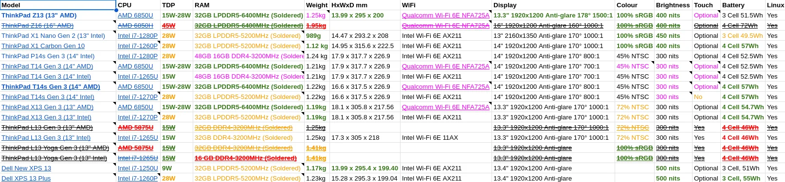
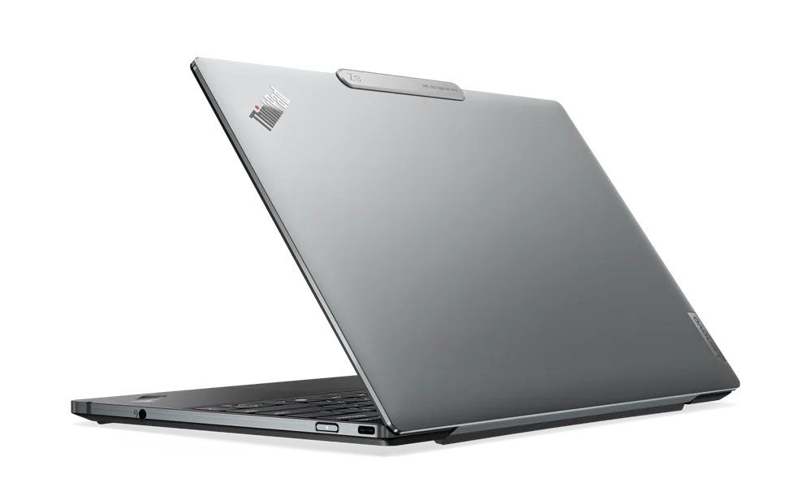
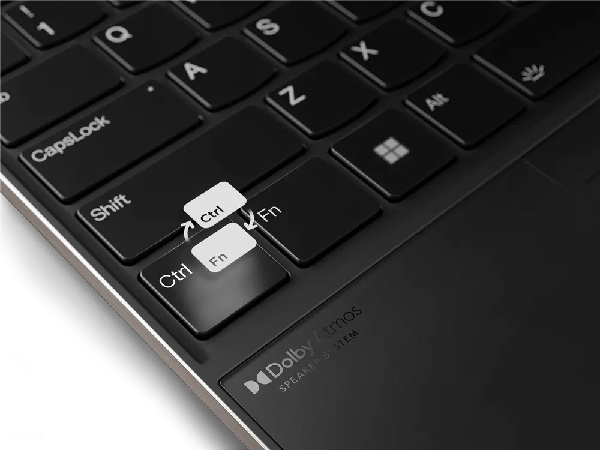
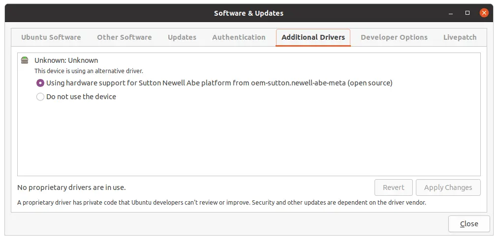
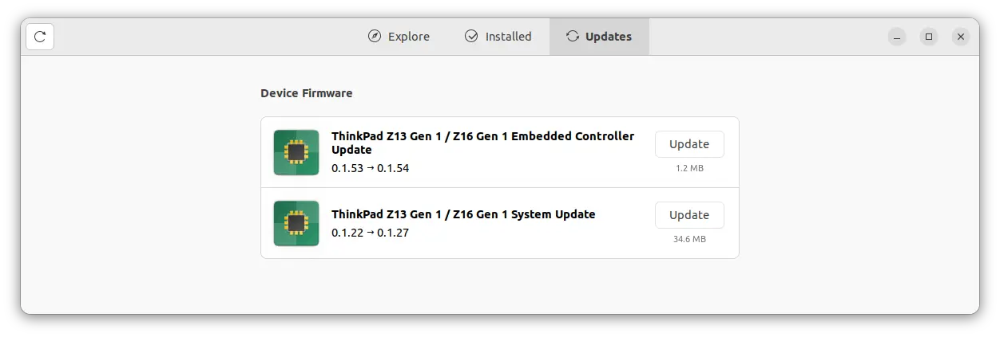

During the second half of 2022, I dusted off my laptop and travelled to three events for the first time in over two years. During these trips, it became apparent that my laptop is not the right tool for the job.

At [KubeCon EU 2022](https://events.linuxfoundation.org/archive/2022/kubecon-cloudnativecon-europe/) my colleague Lindsay brought her [Apple Macbook Pro M1](https://www.apple.com/uk/macbook-pro-13/). It was lightweight, compact, looked fabulous and had epic battery life. Meanwhile, my ThinkPad P1 Gen 1 looked fabulous but is a bit of a chonker and a massive power pig 🔌🐖 Battery anxiety was constant that week and also on my subsequent trips to [SREday 2022](https://www.sreday.com/) and the [Ubuntu Summit 2022](https://events.canonical.com/event/2/). Sensing that 2022 wasn't an outlier and more travel would be on the cards in 2023 I decided that I wanted some of that thin and light laptop action. So, with all that in mind, in early December 2022, I went hunting for a Linux laptop and this is my journey.

## As featured on Linux Matters! 🎙️

I recently discussed my hunt for a new Linux Loving Laptop on the [Linux Matters](https://linuxmatters.sh/) podcast. **You can hear that discussion with my friends Alan and Mark on [Linux Matters: Mastodon on My Résumé (Episode 1)](https://linuxmatters.sh/1/)**.

## Past laptop purchasing mistakes 😱

> "Those that fail to learn from history are doomed to repeat it" - Winston Churchill.

The requirements for my last two laptop purchases were very different from what I need today; a [Dell XPS 15 5550](https://www.dell.com/en-uk/shop/laptop-computers-2-in-1-pcs/precision-5550-mobile-workstation/spd/precision-15-5550-laptop) and [ThinkPad P1 Gen1](https://www.lenovo.com/gb/en/p/laptops/thinkpad/thinkpadp/thinkpad-p1/22ws2wpp101) Both have significant power requirements with 15.6" UHD displays and discrete NVIDIA GPUs. The ThinkPad P1 Gen also sports a Xeon CPU ⚡️ These made sense when I bought them, I was travelling one week every month and regularly compiling large applications, building container images, VMs and operating system images. These days I have a [Threadripper 3970X](https://www.amd.com/en/products/cpu/amd-ryzen-threadripper-3970x) workstation at home that I can connect to via [Tailscale](https://tailscale.com/) to run compute-intensive tasks. I simply don't need a workhorse 🐴 laptop anymore.

### Laptop criteria 📑

I'm deeply impressed with the outstanding work the [Asahi Linux](https://asahilinux.org/) team are doing to enable Linux on Apple Silicon Macs, but running Linux on an M1 Mac isn't viable for me as some hardware support (HDMI for example) is still a work in progress. Not ideal when you're a conference speaker and running booth demos.

These are my criteria for the new laptop. Some must-haves, some nice-to-haves and some hard exclusions.

- Fully Linux compatible.
  - Linux pre-installed to demonstrate Linux is fully supported
- Full working day battery life; ~8 hours in my opinion.
- Low-power CPU, 35W or under
  - Ideally AMD 6000 series but a 12th Gen Intel as a compromise
  - No 11th Gen Intel or AMD 5000 series CPUs will be considered
- 64GB RAM, will compromise on 32GB RAM
- 13" or 14" 1920x1200 matte display
  - No UHD resolutions display will be considered (for power-saving reasons)
  - Touch support is a nice-to-have, but not essential
  - 1920x1080 as a compromise, but nothing lower
- No discrete GPU. Again for power-saving reasons.
- USB-C charging
- Dual NVME SSD, or at least a single 2TB (or more) SSD
- Decent keyboard and touchpad
- The Laptop should weigh close to 1kg
- Premium build quality and design (somewhat subjective I know)

With this list of requirements established, I [started collating Linux laptop comparison notes in this somewhat idiosyncratic spreadsheet](https://docs.google.com/spreadsheets/d/1kaB1pxbbYa1ebxeDRTguQ9EZol1EhM-0FE45Da8AOn8/edit#gid=0)

  
   
  <em>A spreadsheet that probably only makes sense to me </em>

Looking at the list of laptops in the sheet above, you might be wondering why I didn't consider any laptops from the established dedicated Linux laptop vendors such as [Entroware](https://www.entroware.com/store/), [Slimbook](https://slimbook.es/) and [StarLabs](https://starlabs.systems/). Well, I did look at everything they offered at the time and none of them had a model available that met the requirements I've outlined above or the estimated dispatch time was nearly half a year.

I'm not going to elaborate on the rationale behind ruling certain laptop models in or out, but I will say this; I was very impressed to see [**every laptop in the Lenovo ThinkPad lineup had a Linux pre-install option**](http://lenovo.com/linux) of either [Ubuntu](https://ubuntu.com) or [Fedora](https://getfedora.org/) in "Build YourPC" system configurator. While comparing the power requirements of Intel's i7-12xx series and AMD's 68x0 series CPU at the time, I was sold on the impressive battery endurance of AMD's offerings and the superior integrated graphics, so I excluded any laptop with Intel CPUs quite early on.

## Lenovo ThinkPad Z13 Gen 1 with Ubuntu pre-installed

I went with the [ThinkPad Z13 Gen 1](https://www.lenovo.com/gb/en/p/laptops/thinkpad/thinkpadz/thinkpad-z13-(13-inch-amd)/21d2cto1wwgb1) with Ubuntu pre-installed, and the [ThinkPad T14s Gen 3](https://www.lenovo.com/gb/en/p/laptops/thinkpad/thinkpadt/thinkpad-t14s-gen-3-(14-inch-amd)/len101t0015) was runner-up in my selection process.

### Specifications 📝

The key specifications for the laptop I ordered are AMD Ryzen 7 PRO 6850U CPU, 32 GB LPDDR5-6400MHz (Soldered), 1 TB SSD M.2 2242 PCIe Gen4, 13.3" WUXGA (1920 x 1200), IPS, Anti-Glare, Non-Touch display weighing in at 1.19kg. I think this configuration hits the sweet spot for battery endurance, more on that later.

I'm not a fan of the increasing trend of soldering RAM on motherboards, but that was common across all the models of laptops I was considering. If [Framework](https://frame.work/gb/en) had offered an AMD 6000 series CPU option at the time, I would've had a Framework laptop on my short list as the modular design of the Framework laptops is very appealing.

And yes, I did make a compromise with the laptop specifications; that 1TB M.2 SSD is below my minimum requirement of 2TB. I did do my homework though and will present my creative upgrade solution in a future blog post. [Like and Subscribe](/posts/rss.xml) 😉

### Build Quality & Design 💻️

Without a doubt, the ThinkPad Z13 Gen 1 is a gorgeous laptop. I do not have enough superlatives to express just how much I love it. It is, in my option, it is an almost flawless design. Exactly the compact form factor laptop I was seeking; it's beautiful to look at from any angle and a delight to use. Here are some highlights.

  
   
  <em>ThinkPad Z13 Gen 1</em>

The laptop is engineered from 75% recycled aluminium and 95% recycled plastics, then boxed in 100% renewable, compostable packaging. The touchpad is sublime and amazingly 120mm wide on the compact laptop. The haptic touch is simply excellent. The touchpad is the most Macbook-like touchpad I've used on any PC and it is so good it has caused me to change what desktop environment I now use. More on this in a future blog post. However, there is currently no Linux software to [configure the haptic touchpad settings](https://psref.lenovo.com/syspool/Sys/PDF/datasheet/ThinkPad_Z_Series_Haptic_TouchPad_Settings.pdf) such as click force and touchpad feedback intensity but I've been perfectly happy with the defaults. If you do dual boot Windows the haptic settings configured via Windows are stored on the device and carry over to Linux.

The Keyboard is an excellent low-profile design, each key has ~1.2mm of travel which is the same as the actuation point on my Razer Huntsman V2 TKL keyboards with opto-mechanical switches. Most importantly the Fn</kbd> key is in the correct place on the Z13 and not where ThinkPads have been incorrectly plonking it for years. Fight me! 🥊 If you are a long-time ThinkPad owner, it is likely you'll hate the idea of the keyboard and touchpad on the Z13 since it is quite a departure from the traditional design. But I went into this with my eyes 👀 open and have watched and read many reviews.

  
   
  <em>"This is the way"</em>

The Display is bright (400nits), anti-reflective and anti-smudge, covers 100% of the sRGB colour gamut and the laptop is perfectly balanced so it can be opened one-handed. I'm embracing the compact, thin and light lifestyle. So the two USB-C ports are fine with me as I've chosen a laptop configuration with excellent battery endurance (more on that in a bit) and plan to use completely untethered most of the time, only having cables and adapters plugged in for very specific tasks and overnight recharging.

I do have one niggle though; there is an unusable 2242 M.2 slot on the motherboard. It is only intended for use with select models of WWAN cards, none of which are a configuration option for the UK models of the Z13. It doesn't look like the antenna is wired in either, so even if you do get a supported WWAN card aftermarket it is unlikely to work well; if at all. I can share my iPhone's mobile service via Wifi, so not a deal breaker in that regard but it is rather annoying to have an M.2 slot on the motherboard and nothing I can do with it.

### Ubuntu pre-install experience 👌

It is worth noting that at the time of purchase, selecting Ubuntu or Fedora in the system configuration on the Lenovo website applied a £155 discount! 🤑 Choosing Ubuntu or Fedora across the ThinkPad line applies a discount, although the amount varies based on the model.

All OEMs that partner with Ubuntu get an OEM designation for each device officially endorsed and supported by Canonical. The ThinkPad Z13 Gen 1 is known as *Sutton Newell Abe* and the `oem-sutton.newell-abe-meta` package (along with the assosicate OEM PPA) provides the device-specific hardware enablement and power management tuning.

  
   
  <em>ThinkPad Z13 Gen 1 is known as Sutton Newell Abe for OEM enablement</em>

The OEM image of Ubuntu differs from the standard Ubuntu image in a few ways. The most obvious is that OEM image comes with recovery media creation pre-installed. This is a great feature and I highly recommend you use it to create a recovery USB stick, either during the initial setup or post-setup. The OEM image also comes with Chromium and Firefox installed, as opposed to just Firefox in the downloadable release of Ubuntu. IIRC, this is because Chromium has traditionally worked better with touchscreen laptops.
The fingerprint works. I was able to set it up and use it to authenticate logging in via GDM. But the biometrics support does extend throughout the system. Ubuntu Software doesn't integrate with the fingerprint reader, neither does `snapd` or any other privilege escalation.

I also experience the touchpad becoming unresponsive, requiring and click to "unfreeze" it. This happens quite frequently and detracts from what is otherwise an excellent, class-leading, touchpad. Both these issues with the fingerprint reader and touchpad are Ubuntu-specific and nothing related to the actual hardware. Both issues are absent when running NixOS. I suspect it is overly aggressive power management settings in the OEM image, but I didn't investigate beyond that hunch.

Having a tier-1 vendor such as Lenovo ship a laptop with Ubuntu pre-installed has the benefit of great firmware support. I've received several firmware updates since I got the laptop, and they have all applied without issue.

  
   
  <em>Firmware updates for the ThinkPad Z13 Gen 1 on Ubuntu 20.04</em>

#### Why not Ubuntu 22.04? 🤔

My Z13 was shipped with Ubuntu 20.04.4 with OEM optimised Linux kernel 5.14.0-1054-oem. Some might be perplexed (or annoyed) that it didn't come with Ubuntu 22.04, given it was ordered in late 2022. I used to work for Canonical, and during that time worked with Lenovo to enable Ubuntu on ~60 of their laptops and workstations between 2019 and 2021, so I do have some insight into how this process works. It simply boils down to how the factory image certification process works, and once an image is qualified that is what ships on the device for the duration of its availability. Re-certification adds cost and takes time, so it's extremely rare for a device to have a revised factory image qualified once it has gone on sale.

Upgrading to Ubuntu 22.04 LTS worked flawlessly, full audio support was restored and no other hardware supported regressed. Brilliant.

#### Linux Kernel 6.1 🌰

The pre-installed Ubuntu and Fedora images for the Z13 come with kernels that have backported patches applied to fully support the device. If you buy a ThinkPad Z13 and plan to run another Linux distro on it, make sure you can install Linux kernel version 6.1 or newer. This is to ensure the Qualcomm Wi-Fi 6E NFA725A 2x2 AX chipset is fully supported and that the required patches to properly suspend and resume are available.

### Battery endurance 🔋

This is, after all, my most important selection criteria. The conclusion here is simple: **11 hours** ⏱️

This is 11 hours of mixed-use. Coding in Visual Studio Code. Chatting in Slack and Discord. Video calls in Google Meet and Zoom. Compiling software. Some screen capture with OBS Studio and basic video editing with Shotcut. Closing the lid of the laptop and leaving it suspended for 24 hours depletes the battery by ~4% which is about 2 Wh. Very respectable. I haven't felt the need to profile power use or tweak anything, I get plenty of untethered compute time. I'm very happy with the battery life, typically charging the laptop overnight while I sleep and running it all day battery only.

## What's next? 🔮

As noted, I did compromise on the 1TB M.2 SSD. I've come up with an aftermarket solution to upgrade to 2TB which I will post about soon. I chose a laptop pre-installed with Linux for two reasons:

- Support companies shipping Linux operating system pre-installed on their laptops and workstations
- Hard proof Linux works on their hardware

After using Ubuntu for a few weeks I switched to NixOS. I will be posting about my experience with NixOS on the Z13 in a future blog post and [will likely livestream about it on Twitch](https://twitch.tv/WimpysWorld) as well. TL;DR NixOS 22.11 has fewer issues than Ubuntu 22.04 on the ThinkPad Z13 Gen 1.

The ThinkPad Z13 Gen 1 is an excellent laptop for my requirements, and I have no regrets. If I were to buy I laptop pre-installed with a Linux distro in the future, I might go for Fedora, just so I can see what the OEM experience is like with Fedora.

Since I purchased the Z13, [Framework has announced AMD 7040-series powered laptops](https://frame.work/gb/en/blog/framework-laptop-13-with-13th-gen-intel-core-and-amd-ryzen-7040-series) are coming later in 2023; and I'm not sure I can resist...
