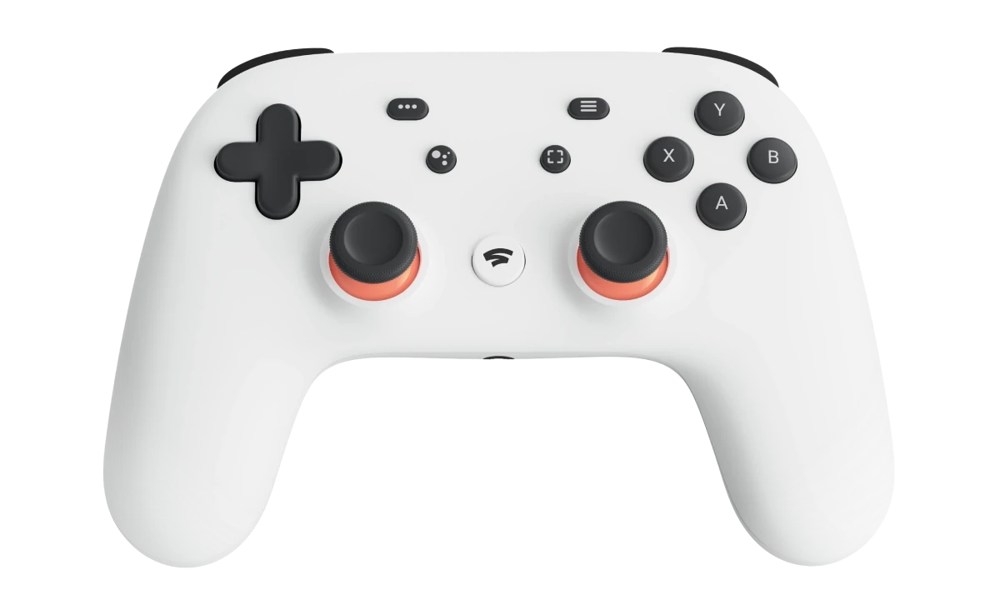
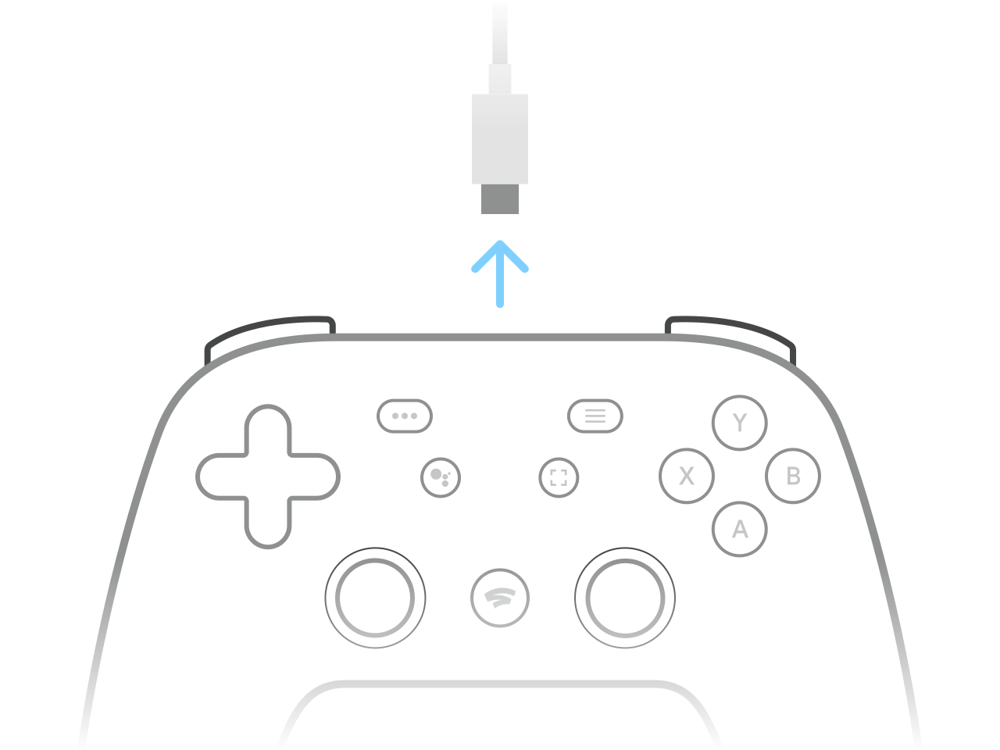
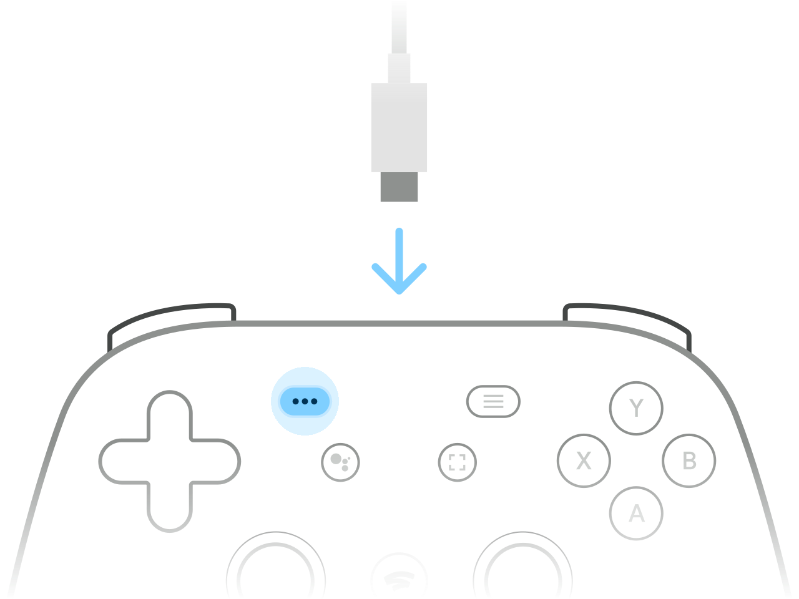
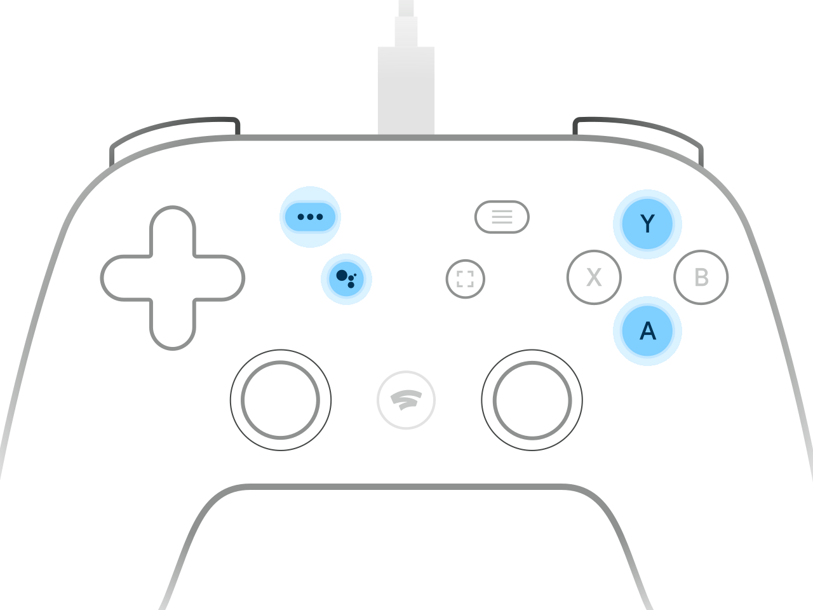
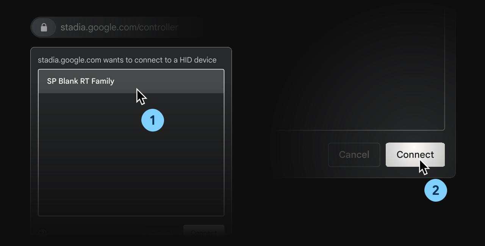
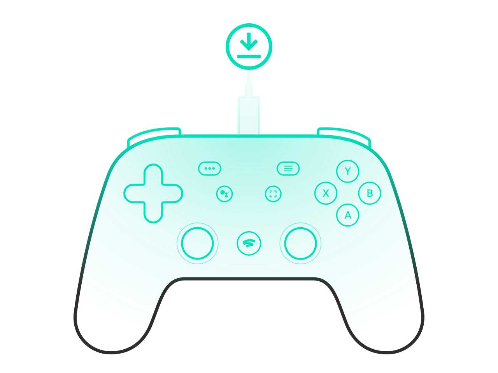
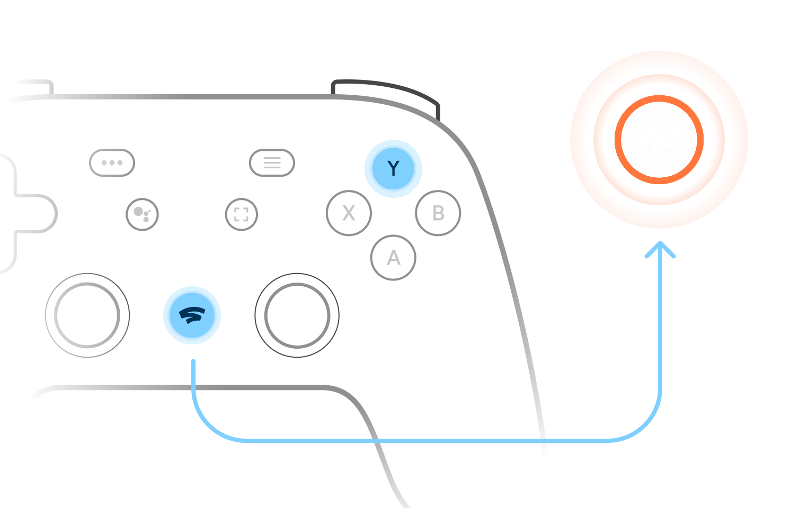

I was a [Google Stadia](https://stadia.google.com/gg/) "founder" and when it was shut down on January 18, 2023 I was left with 3 perfectly usable Stadia Controllers; provided I could connect them using a USB-C cable. I quite like the Stadia Controller, the form factor is similar to the PlayStation DualShock but with an Xbox style button layout.

<p class="text-center">
  
  <br />
  <em>Stadia Controller</em>
</p>

While using it via USB-C is great for PC, wireless connectivity would provide more options. Thankfully [Google released Bluetooth firmware for the Stadia Controller](https://stadia.google.com/controller) which disables Stadia's proprietary Wi-Fi connectivity and enables Bluetooth® Low Energy (BLE). You can then use it like a standard wireless Bluetooth controller with other hardware and also still plug your Stadia Controller into a device with a USB-C cable.

## Compatibility 🧩

The [Stadia Controller Device Compatibility List](https://support.google.com/stadia?p=controllerconnect#devicelist) says

> "Testing of Bluetooth mode was focused on the devices and systems listed below, but may not work with all hardware configurations."

- Windows 10 and 11 + Steam
- MacOS® 13 + Steam
- ChromeOS
- Android

Most importantly, it says ***"computers must have a Bluetooth Low Energy adapter in order to communicate with the Stadia Controller in Bluetooth mode and that hardware compatibility will vary."***

## Flash Stadia Controller Bluetooth Firmware using Ubuntu 22.04 🐧

Here's how I flashed that firmware on all 3 of my controllers using Linux; well Ubuntu 22.04 to be precise. The system requirements for the Bluetooth Firmware tool is stated to be Chrome 108 or newer. No problem! But, I was unable to get the controllers to show up in Chrome until some `udev` rules were added. Open a terminal and run the following command from any directory:

```shell
{ cat <<EOF
# SDP protocol
KERNEL=="hidraw*", ATTRS{idVendor}=="1fc9", MODE="0666"
ACTION=="add", SUBSYSTEM=="usb", ATTR{idVendor}=="1fc9", MODE="0666"
ACTION=="add", SUBSYSTEM=="usb", ATTR{idVendor}=="0d28", MODE="0666"
# Flashloader
KERNEL=="hidraw*", ATTRS{idVendor}=="15a2", MODE="0666"
# Controller
KERNEL=="hidraw*", SUBSYSTEM=="hidraw", ATTRS{idVendor}=="18d1", MODE="0666"
SUBSYSTEMS=="usb", ATTRS{idVendor}=="18d1", ATTRS{idProduct}=="9400", MODE="0660", TAG+="uaccess"
EOF
} | sudo tee /etc/udev/rules.d/70-stadiacontroller-flash.rules
```

Now run the following to reload the `udev` rules.

```shell
sudo udevadm control --reload-rules
sudo udevadm trigger
```

With that done, I restarted Google Chrome and followed the instructions on the [Stadia Controller Firmware Flashing Tool](https://stadia.google.com/controller/index_en_GB.html) page. I was able to flash the firmware on all 3 of my controllers. The process is pretty straightforward but I've included the instructions below for reference.

### Charge your controller

Make sure that your controller has been charged for 30 minutes and that you're using a USB data cable.

<p class="text-center">
  
  <br>
  <b>Charge your controller</b>
</p>

### Unplug your controller to power it off

If it turns on again, hold the Stadia button for 4 seconds to power it off

<p class="text-center">
  
  <br>
  <b>Unplug your controller to power it off</b>
</p>

### Hold the option button (three dots) while plugging in your controller

The status light should remain off. If it turns on, unplug the controller and try again

<p class="text-center">
  
  <br>
  <b>Hold the option button (three dots) while plugging in your controller</b>
</p>

### Press the Option, Assistant, A, and Y buttons at the same time

There won't be any controller feedback, proceed to the next step to confirm the controller is unlocked

<p class="text-center">
  
  <br>
  <b>Press the Option, Assistant, A, and Y buttons at the same time</b>
</p>

### Select your controller in the Chrome device list and click "Connect".

The text in the flashing utility says the Stadia Controller should be named **"SP Blank RT Family"** or "Stadia Controller" or "USB COMPOSITE DEVICE".

<p class="text-center">
  
  <br>
  <b>Select your controller in the Chrome device list again and click "Connect".</b>
</p>

### Download complete

You've almost finished. Go to the final step to install the latest version of Bluetooth mode on your controller.

<p class="text-center">
  
  <br>
  <b>Download complete</b>
</p>


### Install Bluetooth mode

One more time - select your controller in the Chrome device list, then click "Connect". Installation will start automatically and should only take a minute.

The text in the flashing utility says the Stadia Controller should be named **"USB COMPOSITE DEVICE"** or "Stadia Controller" or "SP Blank RT Family".

<p class="text-center">
  
  <br>
  <b>Install Bluetooth mode</b>
</p>

### Installation complete

Wait a minute or so for the firmware installation to complete.

<p class="text-center">
  
  <br>
  <b>Installation complete</b>
</p>

## Pairing Stadia Controller with Bluetooth

Hold the Y and Stadia buttons for 2 seconds until the status light flashes orange. It is now in pairing mode and visible to other devices.

<p class="text-center">
  
  <br>
  <b>Pairing Stadia Controller with Bluetooth</b>
</p>

## Hurray up! ⏳️

**After the shutdown in January 2023, you have until December 31, 2023, to update the controller so it can use Bluetooth mode.**

Fortunately, the [Stadia Controller firmware has been archived](https://github.com/Scyne/stadiaRawBtFw) and an [Unofficial Stadia Controller Flashing utility](https://luigimannoni.github.io/stadia-controller-flasher/) created which might prove useful after December 31, 2023.

- [**Unofficial Stadia Controller Flashing utility**](https://luigimannoni.github.io/stadia-controller-flasher/)

Your mileage may vary using the re-implementation of the [Utility for flashing Stadia Controllers](https://github.com/luigimannoni/stadia-controller-flasher), so if you're doing this before December 31, 2023, use the [official tool](https://stadia.google.com/controller/).

## Conclusion

After updating my Stadia Controllers with Bluetooth firmware, I've successfully paired them with my Android tablet, iPhone 13 and [ChimeraOS](https://chimeraos.org/); an operating system that provides an out-of-the-box couch gaming experience 🎮️ While Stadia might be dead and gone, I'm very happy to continue to get utility out of the controllers; which turned out to be free after the reimbursement Google offered when Stadia was shut down.
