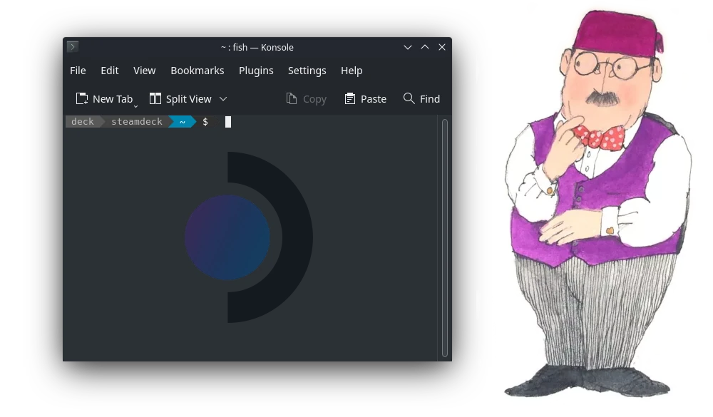

It took 9 episodes of [Linux Matters](https://linuxmatters.sh) for my friends and co-hosts [Alan](https://linuxmatters.sh/host/apope/) and [Mark](https://linuxmatters.sh/host/mjohnson/) to wear down 😅 my resolve to buy a [Steam Deck](https://www.steamdeck.com/en/), even [after I passed on my original Steam Deck pre-order](/posts/steambox-vs-steamdeck/).
I'm glad they did, it's a great little device and a dream come true for Linux 🐧 nerds; excellent hardware and completely hackable 🧑‍💻

I ordered the 64GB model via the recently announced [Steam Deck™ Certified Refurbished](https://store.steampowered.com/sale/steamdeckrefurbished) program.
I'm going to resist retrofitting a larger NVMe SSD, and have instead added a 1TB microSDXC card 💾
The 64GB internal eMMC storage will be used for SteamOS and the microSDXC card will be used exclusively for games 🕹️

While I'm avoiding hardware modifications, I do want to install some software enhancements on the Steam Deck; specifically [ZeroTier](https://www.zerotier.com/).
**I spoke enthusiastically about ZeroTier in [Linux Matters: Picking Apart the Steam Deck (Episode 8)](https://linuxmatters.sh/episodes/8/)**; it is as essential as WiFi for me.
So, give that episode a listen to hear why I love ZeroTier so much 💖

<p class="text-center">
  <a href="https://linuxmatters.sh" target="_blank"></a>
  <br />
  <em>Linux Matters Podcast</em>
</p>

What follows is a guide to installing ZeroTier on the Steam Deck, but this technique can be used to install any software on Steam Deck that is available for Arch Linux 👍️

# Installing ZeroTier on Steam Deck

The Steam Deck has a (*mostly*) read-only filesystem.
We'll use [Rwfus: Read-Write OverlayFS for your Steam Deck](https://github.com/ValShaped/rwfus) to install ZeroTier so that it persists across reboots *and* SteamOS updates.

The author describes `rwfus` as:

> a vinyl couch cover for your filesystem, Rwfus covers your Deck's `/usr/` directory (and some others) allowing you to initialize and use `pacman` (the Arch Linux package manager) on the Steam Deck without losing packages when the next update comes out.

Perfect 👌️

## Enter the Desktop

The process of installing and configuring ZeroTier requires the use of the Steam Deck desktop mode.
Connecting a mouse 🖱️ and keyboard ⌨️ to the Steam Deck will make this process much easier.
After the Steam Deck has booted you should Switch to Desktop.

- Press the "Steam" button on the Steam Deck and scroll down through the menu and select "Power".
- Then, select the "Switch to Desktop" option.
- Once the desktop has loaded, click on the Steam Deck logo in the lower-left corner of the desktop to bring up the menu.
- Select "System" in the left column and then "Konsole" from the right column.
  - You can also press the Super key and type in "Konsole" in the search bar.
- Suddenly, as if by magic, the terminal appeared 🪄

<p class="text-center">
  
  <br />
  <em>Konsole on Steam Deck</em>
</p>

## Set a Password

By default, no password 🔓️ is set for the `deck` user.
With no password set, it is not possible to run commands in the root content using `sudo`.
Type `passwd` in the terminal to set a password.

```shell
(deck@steamdeck ~) $ passwd
New Password:
Retype New Password:
```

## Install Rwfus

With that done we can install `rwfus`.

```shell
git clone https://github.com/ValShaped/rwfus.git
cd rwfus
./rwfus -iI
```

## Install ZeroTier

Run `sudo pacman -Sy` to update your repositories 🌿
Now install ZeroTier.

```shell
sudo pacman -S zerotier-one
```

### Enable and Start ZeroTier service

ZeroTier installs its systemd unit in `/usr/lib/systemd/system/`, but as we're installing while Rwfus is active that service file is installed into the Rwfus overlay.
This is a problem because running `systemctl enable zerotier-one` now would create a systemd unit in `/etc/systemd/system/multi-user.target.wants/` that references a file in `/usr`, and that file will not exist until Rwfus is running.
The effect is that the ZeroTier service will not start on boot as systemd will not be able to find the service file.

But there is a simple workaround, copy the ZeroTier service file to `/etc/systemd/system`, which is fine as `/etc` is already a writable overlay.

```shell
cp /usr/lib/systemd/system/zerotier-one.service /etc/systemd/system/zerotier-one.service
```

Now, enable and start the ZeroTier service.

```shell
sudo systemctl enable zerotier-one --now
```

## Join a ZeroTier Network

Find your ZeroTier device ID (a 10-digit hexadecimal number) by running:

```shell
sudo zerotier-cli info
```

The output will look 👀 something like this:

```text
200 info deadbeef00 1.10.1 OFFLINE
```

Join a ZeroTier network using a network ID (a 16-digit hexadecimal number) which you can get from the [My ZeroTier page](https://my.zerotier.com/).

```shell
sudo zerotier-cli join <network id>
```

Return to the [My ZeroTier page](https://my.zerotier.com/) select the network you joined, scroll down to the Members section and authorize the Steam Deck device ID.

Verify that the Steam Deck is correctly allocated an IP address, this may take up to 30 seconds ⏳️

```shell
ip --brief addr | grep ^zt
```

You should see 👁️ output similar to this:

```text
zta1b2c3d4       UNKNOWN        192.168.192.59/24 baad::4a4a:faff:fefe:5aa5/64
```

## Use your ZeroTier network

You can now connect from your Steam Deck to other devices on the same ZeroTier network.
Or you could enable SSH on the Steam Deck and then log in to it from another device on the ZeroTier network 💪

```shell
sudo systemctl enable sshd --now
```

## Conclusion

With ZeroTier installed on the Steam Deck, it is part of my network where ever I may roam; and enables some interesting possibilities such as remote play from anywhere in the world or [playing LAN multi-player games with remote friends](https://steamcommunity.com/sharedfiles/filedetails/?id=2632149295).
Share in the comments how you're using ZeroTier on your Steam Deck 💬

<p class="text-center">
  
  <br />
  <em>Steam Deck</em>
</p>

I'll be keeping my Steam Deck software modifications to a minimum 🤏 but where I do make changes I'll be careful not to disrupt the SteamOS root file systems or potentially break SteamOS updates.
I'm glad solutions like Rwfus exist to allow me to install the software I need. But.... 🤔

[Nix](https://nixos.org) is what I work on as my day job at [Determinate Systems](https://determinate.systems) ❄️
I'm creating a little project that any Steam Deck owner can use to bring the power of Nix to Steam Deck while maintaining isolation from the SteamOS root file system.
That project depends on the [Determinate Nix Installer](https://github.com/DeterminateSystems/nix-installer), **which natively supports Steam Deck**.
So, if you want to get a head start with Nix on the Steam Deck then you can do that today 🙂
