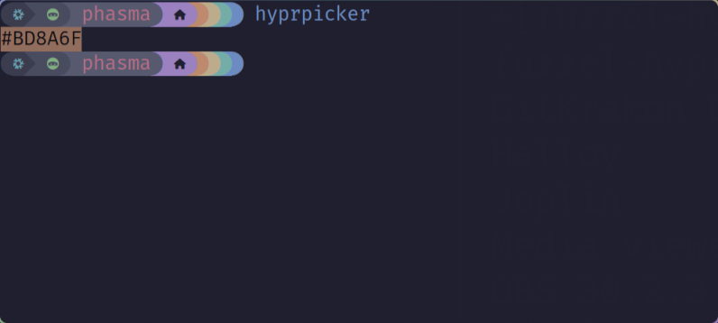
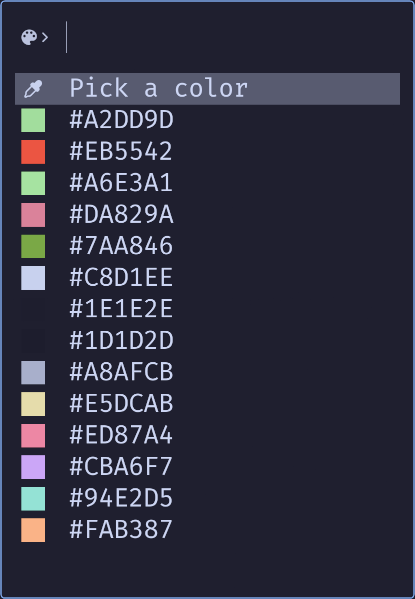
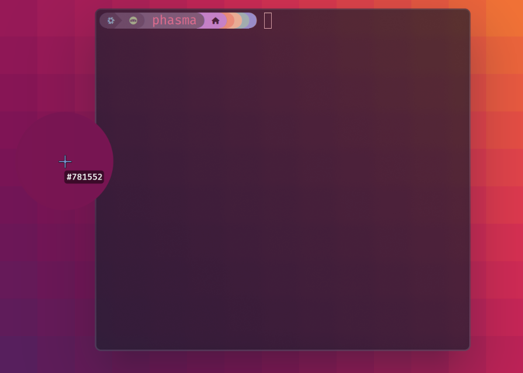
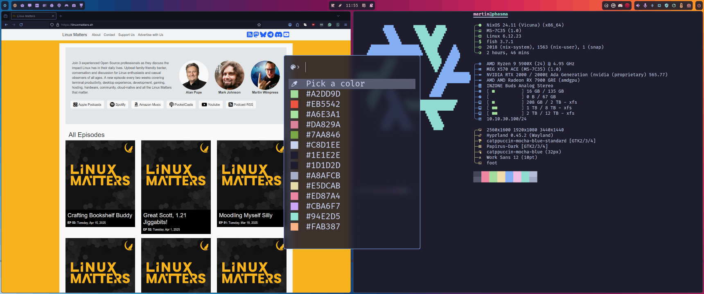

We've all been there - you're knee-deep in customizing your desktop, tweaking configs, perfecting that theme, and suddenly you need to grab a specific colour from somewhere on screen.
If you're like me and recently made the jump to [Hyprland](https://hyprland.org/) (or other contemporary Wayland compositor), you might have found yourself missing some of those handy X11 utilities that *"just worked"* ️™️

## The Wayland Colour Picker Problem

When I switched my daily driver to Hyprland back in August 2024, I was chuffed with the smooth animations, efficient tiling, and general polish.
But as with any big change, there were a few splinters in my workflow that needed sorting.

One particular rough edge was the lack of a proper GUI colour picker.
On X11, I'd been spoiled by my mate [Stuart Langridge](https://mastodon.social/@sil)'s excellent tool **[Pick](https://www.kryogenix.org/code/pick/)** - a proper colour picker that did exactly what it said on the tin.
But in Wayland? Well, I was left running [`hyprpicker`](https://github.com/hyprwm/hyprpicker) from the terminal like some kind of savage! 😅

<p class="text-center">
  
  <br />
  <em>hyprpicker in the terminal</em>
</p>

Don't get me wrong - `hyprpicker` works brilliantly for what it is.
But after seeing how well my recent integrations of [**bzmenu**](https://github.com/e-tho/bzmenu) and [**iwmenu**](https://github.com/e-tho/iwmenu) worked with [Fuzzel](https://codeberg.org/dnkl/fuzzel), a lightbulb moment hit me: why not create a proper Fuzzel-based front-end for `hyprpicker`? 💡

## Birth of fuzzel-hyprpicker

After my second coffee one morning (the optimal programming fuel ☕💪), I decided to tackle this problem head-on.
If I was going to spend hours staring at my [Catppuccin Mocha](https://catppuccin.com/) themed desktop, I needed proper tools to maintain it! ‍🐈‍⬛🎨

The goal was simple:
- Create a Fuzzel-based UI for `hyprpicker`
- Maintain persistent colour history
- Make it keyboard-friendly
- Automatcially copy selected colours to clipboard

The result is [`fuzzel-hyprpicker.sh`](https://github.com/wimpysworld/nix-config/blob/main/home-manager/_mixins/desktop/hyprland/fuzzel/fuzzel-hyprpicker.sh) - a little script that brings together the power of `hyprpicker` with the elegant UI of Fuzzel.

<p class="text-center">
  
  <br />
  <em>fuzzel-hyprpicker showing the colour selection menu</em>
</p>

## How It Works

The magic behind `fuzzel-hyprpicker.sh` is surprisingly straightforward.
Let me walk you through the key bits:

### Setting Up the Basics

```bash
#!/usr/bin/env bash
# A tool to pick colours from the screen using hyprpicker and fuzzel

set +u  # Disable nounset
APP_NAME="fuzzel-hyprpicker"
NOTIFY="notify-desktop --app-name=$APP_NAME --icon=org.gnome.design.Palette"

# Set up the storage directory and file
CONFIG_DIR="${XDG_CONFIG_HOME:-$HOME/.config}/$APP_NAME"
HISTORY_FILE="$CONFIG_DIR/colours.txt"
ICONS_DIR="$CONFIG_DIR/icons"
```

Nothing fancy here - we're just setting up our environment, defining where we'll store our colour history, and setting up notifications.
Note that I properly follow the XDG spec here - it's the little things! 😉

### The Clever Bit: SVG Icons

Here's where things get interesting.
Fuzzel supports icons in its menus, but I needed a way to show colour swatches.
The solution? Dynamically generated SVG files:

```bash
function generate_svg_icon() {
  local colour="$1"
  local icon_path="$ICONS_DIR/$colour.svg"

  # Create an SVG for the colour if it doesn't exist
  if [ ! -f "$icon_path" ]; then
    cat > "$icon_path" <<EOF
<svg width="128" height="128" xmlns="http://www.w3.org/2000/svg">
  <rect width="128" height="128" fill="#$colour" />
</svg>
EOF
  fi
}
```

I'm rather pleased with myself for this solution.
Each time you pick a colour, it generates a tiny SVG file that's just a coloured square.
Fuzzel then displays this next to the hex code in the menu. Well done brain! 🧠

### Menu Building

The menu itself is built dynamically, showing an eyedropper icon for picking a new colour followed by your colour history:

```bash
function build_menu() {
  echo -e "Pick a colour\0icon\x1f$ICONS_DIR/eyedropper.svg"
  # Add history items if they exist
  if [ -s "$HISTORY_FILE" ]; then
    while read -r colour; do
      # If the preview icon doesn't exist, generate it
      if [ ! -e "$ICONS_DIR/$colour.svg" ]; then
        generate_svg_icon "$colour"
      fi
      # Display the colour with a preview
      echo -e "#$colour\0icon\x1f$ICONS_DIR/$colour.svg"
    done < "$HISTORY_FILE"
  fi
}
```

This uses the [`rofi`](https://github.com/davatorium/rofi) "protocol" for menu items, something Fuzzel has built-in support for 💖
The `\0icon\x1f` bit is how you tell Fuzzel *"hey, use this icon for this menu item"*.

### Putting It All Together

The full workflow goes like this:

1. Press <kbd>Ctrl</kbd> + <kbd>Alt</kbd> + <kbd>K</kbd> to open the picker
2. Select **"Pick a colour"** or choose one from your history
3. If picking a new colour, `hyprpicker` does it's thing and click anywhere on screen
4. The colour gets automatically copied to your clipboard
5. A notification appears showing the selected colour

<p class="text-center">
  
  <br />
  <em>hyprpicker colour selection</em>
</p>

## Integrating It With Your Setup

Want to give this a try yourself?
Here's how to adapt it to your wlroots-compatible desktop:

1. First, make sure you have the following installed:
   - `hyprpicker`
   - `fuzzel`
   - [`wl-clipboard`](https://github.com/bugaevc/wl-clipboard) (for clipboard management)
   - [`notify-desktop`](https://github.com/nowrep/notify-desktop) (for notifications)
     - Although I'm planning on switching to [`fyi`](https://codeberg.org/dnkl/fyi) soon...  

2. Save the script somewhere in your path (I've got mine as part of [my Nix configuration](https://github.com/wimpysworld/nix-config)) ️❄️

3. Make it executable:
```bash
chmod +x fuzzel-hyprpicker.sh
```

4. Bind it to a keyboard shortcut in your Hyprland config:
```
bind = CTRL ALT, K, exec, fuzzel-hyprpicker.sh
```

5. Give it a whirl!

It should work with any wlroots-compatible compositor, not just Hyprland.

## Possible Enhancements

This is very much a v1 and there's plenty of room for improvement:

- Add support for different colour formats (RGB, HSL, etc.)
- Implement colour name lookup
- Create a proper project rather than just a script wedged in my Nix configuration

But for a morning hack, it's been surprisingly useful!
Reaching for <kbd>Ctrl</kbd> + <kbd>Alt</kbd> + <kbd>K</kbd> brings a smile to my face 😀

## The Joy of Keyboard-Driven Workflows

What I love about tools like this is how they contribute to a cohesive, keyboard-driven workflow.
Between Hyprland's tiling, Waybar's status info, and Fuzzel-based menus for everything from launching apps to picking colours, my fingers rarely stray from the keyboard these days.

There's something deeply satisfying about crafting your own tools to scratch your own itches.
It's a long held Linux desktop tradition, isn't it?
Taking what works, improving what doesn't, and sharing the results with others.

<p class="text-center">
  <a href="https://linuxmatters.sh" target="_blank"></a>
  <br />
  <em>My hyprland desktop with fuzzel-hyprpicker in action</em>
</p>

## More Fuzzel-Based Tools?

I've created several other Fuzzel menus that integrate with my Hyprland desktop.
I should probably post about those as well - emoji picker and screenshot and screen recording being among my most useful.
Let me know in the comments if you'd be interested in seeing those! 👇

In the meantime, give `fuzzel-hyprpicker.sh` a try and let me know what you think.
**And if you improve upon it, *please do share your changes!***

The full script is available in my Nix config repository: [fuzzel-hyprpicker.sh](https://github.com/wimpysworld/nix-config/blob/main/home-manager/_mixins/desktop/hyprland/fuzzel/fuzzel-hyprpicker.sh)

Happy colour picking! 🎨🤏

---

*Have you created any custom tools for your Wayland desktop? Are there any X11 utilities you miss since switching? Let me know in the comments below!*