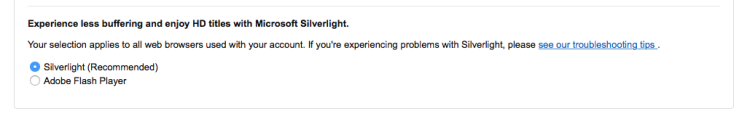

My family watches on-line video streaming services using a mixture of Android
phones/tablet, Rokus and Amazon Fire TV. In terms of desktop and laptop computers
our house is exclusively Linux based, in particular [Ubuntu MATE](https://ubuntu-mate.org)
is popular here.

With a few hours to spare over the new year break I thought I'd see what popular
UK video streaming services were accessible via Ubuntu MATE 14.04. That said,
what follows is applicable to any Ubuntu 14.x release and the technique I used
to coerce Adobe Flash to *"work"* might work with other streaming services
outside the UK.

I used the 64-bit release of Ubuntu MATE 14.04 with the following browser and
Flash versions.

  * Firefox 34 with Abobe Flash 11.2.202.425
  * Chrome 39.0.2171.95 with Flash 16.0.0.235

## UK video streaming services

  * BBC iPlayer
  * ITV Player
  * 4 on Demand
  * Demand 5
  * TV Catchup
  * Netflix
  * Amazon Instant Video

## Blocking adverts

If you use an advert blocker, browser extension or otherwise, then you'll need
to pause it or whitelist the domains for the following UK streaming services:

  * ITV Player
  * 4 on Demand
  * Demand 5
  * TV Catchup

ITV Player, 4 on Demand and TV Catchup will display a pop-up prompting you to
disable advert blocking while Demand 5 will not present any play back controls
until advert blocking is disabled.

## Streaming service quirks

### 4 on Demand

Annoyingly 4 on Demand requires registration before you can access all the
content they have available.

### Amazon Instant Video

Recently Amazon Instant Video UK added a settings option to view content with
Flash rather than with Silverlight. You will need to opt in to using Flash over
Silverlight. To do this head to the Amazon Instant Video landing page, click
`Settings > Player Preferences > Adobe Flash Player`.



## Installing the browsers

### Firefox and Adobe Flash

### Google Chrome

```text
Stream				Firefox		Chrome		Firefox (HAL)	Chrome (HAL)

iPlayer				Yes			Yes			Yes				Yes
ITV Player			Yes			Yes			Yes				Yes
4 on Demand			No [1]		No [1]		Yes				No [1]
Demand 5			Yes			Yes     	Yes				Yes
Netflix				No [4]		Yes			No [4]			Yes
Amazon Instant Video UK		No [2]		No [3]		Yes				No [3]
TVCatchup       	Yes			Yes			Yes				Yes
Plex				Yes			Yes			Yes				Yes
```

[1] Perpetual spinner, no content ever streamed.
[2] Claim the player needs updating.
[3] After `Connecting...` now playback at all.
[4] Requires HTML5 DRM.


I write this up more fully in a blog soon, but here is what I learnt today.

I used Ubuntu MATE 14.04 64-bit to test BBC iPlayer, ITV Player, 4 on Demand, Demand 5, Netflix, Amazon Instant Video (UK) and TVCatchup on Firefox 34 with Flash 11.2.202.425 and Chrome 39.0.2171.95 with Flash 16.0.0.235.

Everything but Netflix works with Firefox, although HAL is required to get 4 on Demand and Amazon Instant Video working. Amazon Instant Video UK recently add a setting to use  Flash rather than Silverlight.

4 on Demand and Amazon Instant Video do not work with Chrome (even if HAL is installed) but all the other services do work.

So I was surprised to find that Firefox on Ubuntu MATE 14.04, once HAL is installed, offers the best compatibility with the common UK streaming services. The reason Netflix doesn't work with Firefox is because it is missing an HTML5 DRM implementation, which is hopefully due soon.


https://bugzilla.mozilla.org/show_bug.cgi?id=eme

HAL explained and stub - https://github.com/cshorler/hal-flash
http://blog.markladoux.com/tags/hal-flash/
